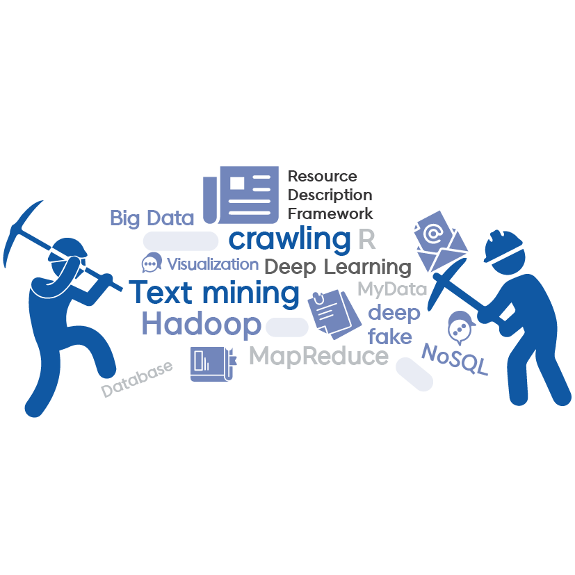

```{r setup, include=FALSE}
knitr::opts_chunk$set(echo = FALSE)
```


# 내가 기대하는 텍스트 분석

오늘날 우리가 어떠한 일을 하고 있는 이 순간에도 방대한 양의 다양한 데이터들이 생성되고 있다. 이러한 정보의 홍수 속에서 원하는 정보를 모두 찾아내기란 쉽지 않은 일이다. 그 중에서도 **텍스트 데이터**는 우리가 문자로 된 언어를 사용하는 한 지속적으로 생성되고 존재할 것이다.

데이터는 같은 데이터임에도 어떻게 수집, 가공, 분석하느냐에 따라 다양한 가치를 창출해낼 수 있다는 점에서 매우 흥미롭다. **텍스트 분석을 통해서 내가 예측했던 결과를 확인해보고 더 나아가 내가 예상치 못한 새로운 가치 또한 발견해보는 경험을 하고 싶다.**

<br>

```{r network, echo=FALSE, out.width = "70%", fig.align='center'}

```
